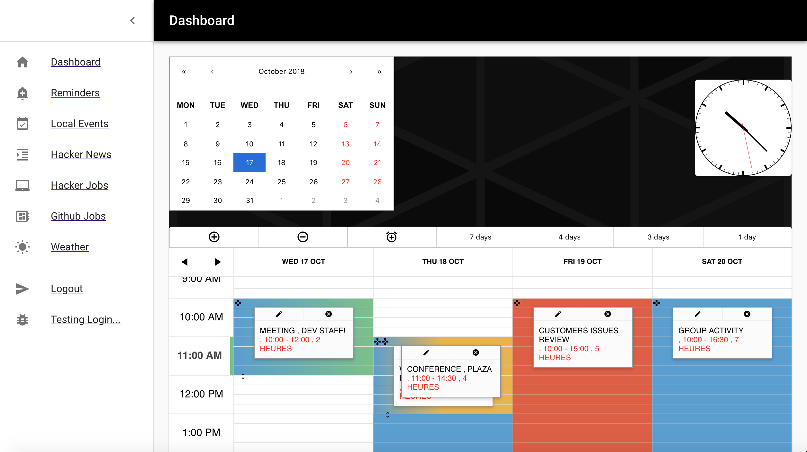

# Dashboard

This application is designed to help assist users during the job search process. With so many job search websites around, it's a challenge to get everything organized to land a job. This app helps organizes your schedule with reminders, shows jobs available from GithubJobs and HackerRank, and displays current news from the tech world. Along with features such as meetup locations, weather, and user login authentication to make the job search process easier.


# Getting Started 

Site Link: [Dashboard](https://dashboardv1.herokuapp.com/)

Once your on the welcome page you can login or register as a new user. When the user want to register, they will be asked to type in their name, location, and career interest that will be used to display their Dashboard. 



The main dashboard page includes a calendar, clock, and daily agenda for the user. The tabs range from weather, jobs available, tech news, and local meetup. Everything the user needs to survive the job search process. 

### Prerequisites

Your can access the site from any interest browser including [Google Chrome](https://www.google.com/chrome/), [Firefox](https://www.mozilla.org/en-US/firefox/new/), or [Safari](https://www.apple.com/safari/). 

# Deployment 

This site is deployed through [heroku](https://shout-it-out.herokuapp.com/), and uses Mongo Database to store information about the user and their components such as locations and reminders. 

# Built With 

* React.js 
* Javascript/JQuery
* MongoDB
* Material UI
* Heroku
* Yarn/Npm
    - Material UI
    - Express
    - Mongoose
    - Passport 
    - Axios 
    - Path
    - Particle.js
    - React Calendar
    - React Clock
    - React Agenda
    - React Moment
    - Prop Type
    - Anime.js

# APIs and Libraries
* [HackerNews](https://news.ycombinator.com/)

    Scrape the news from the website and deploy to dashboard so users know about current events in the tech industry.

* [HackerNews Jobs](https://news.ycombinator.com/jobs)

    Scrape jobs available in the Bay Area so user can know which companies are hiring for desired roles. 

* [Github Jobs](https://jobs.github.com/)

    Another source to search for jobs in the area with extra feature like images, description, and location. 

* [Meetup API](https://www.meetup.com/)

    Shows events happening in the user's area so they can attend and expand their network while also learning about new technology. 

* [Open Weather API](https://openweathermap.org/api)

    Shows current weather of location. User can type the zipcode of their location and receive weather information about the area. 

* [Material-UI](https://material-ui.com/)

    React component that implements Google's Material Design 

# Wireframe and Layout

The layout of this application is built entirely with React.js. With MongoDB used to store user information. We decided to use Mongo because their was only one relationship for this project instead of multiple that require using other databases. The main design for this project was to make it easy for the user to navigate through the app to find jobs, set reminders, or check weather. 

# Tasks:

Here is the scheme of our contributions to the project: 

### [Muhammad](https://github.com/mawais54013)
- Setting up packages
- API configuration
- Styling
- Assisting with setting up routes and using React.js

Many add-on features displayed in the dashboard such as the calendar and the clock are packages found on React.

- react-calendar is used to display the calendar for the user. A simple component that only requires the current date. 
    ```
    <Calendar
    onChange={this.onChange}
    value={this.state.date}
    />
    ```
- react-clock is similar to calendar because it requires the current date and the rest of the functionality is being done with the package. 
    ```
    <Clock
    value={this.state.date}
    />
    ```
- react-agenda is used for users to display their activity throughout the week with the options to adding more. Each item will have their own id, the name of the event, the color, and the dates which the event will be happening as seen in the following code: 
    ```
    {
    _id           :'event-5',
    name          : 'Group activity',
    startDateTime : new Date(now.getFullYear(), now.getMonth(), now.getDate()+3, 10, 0),
    endDateTime   : new Date(now.getFullYear(), now.getMonth(), now.getDate()+3, 16, 30),
    classes       : 'color-4'
  }
    ```

The following shows how most of our API's are structured to receive data from the sources and store them into a state to use later. 

* Once a button is clicked on the side bar, a request is sent to the API. Then the data is stored at a state which we use later with map to display each needed information for the user like links, title, etc. 

```
hackerJobs = () => {
    API.getHackerJobs()
        .then(res => {
            this.setState({ hackJob: res.data})
            console.log(this.state.hackJob);
        })
}
```

For styling we used pics from unsplash.com and coloring from material-ui. But for the animation on the welcome page, we used particle.js and anime.js. Anime.js is used to create the logo for the site, whereas particle.js makes the effects and background movements with the code below: 

```
  <Particles className="visibleInBack"
        params={{
            particles: {
                line_linked: {
                    color: "#ff78ff",

                },
                number:{
                    value:120,
                },
                shape:{
                    type:"circle",
                },
                move:
                    {
                        enable:true,
                        speed:6,
                    }
            }
            ,
            interactivity: {
                "detect_on": "canvas",
                "events": {
                    "onhover": {
                        "enable": true,
                        "mode": "repulse"
                    },
                    "onclick": {
                        "enable": true,
                        "mode": "push"
                    },
                    "resize": true
                },
                "modes": {
                    "grab": {
                        "distance": 50,
                        "line_linked": {
                            "opacity": 1
                        }
                    },
                    "bubble": {
                        "distance": 400,
                        "size": 200,
                        "duration": 2,
                        "opacity": 8,
                        "speed": 5
                    },
                    "repulse": {
                        "distance": 200,
                        "duration": 0.4
                    },
                    "push": {
                        "particles_nb": 300
                    },
                    "remove": {
                        "particles_nb": 10
                    }
                }
            },
            detect_on:"canvas",
        }}
/>
```

Each circle has a set color with the speed movement. Interactivity allows effects to occur if a hover happens around the circles. If a hover is detected then the area is cleared by 50 distance around the hover. The circles are pushed together until no hover is detected. If a user clicks on the animation the more circles are created with slower animation with the limited DOM size. 

### [Andrew](https://github.com/andypants152)

Put your tasks here 

### [Jason](https://github.com/JSutliff)

Put your tasks here 

## Authors
* **Andrew** - https://github.com/andypants152
* **Jason** - https://github.com/JSutliff
* **Muhammad** - https://github.com/mawais54013

## Acknowledgments

* UCB Extension Coding Bootcamp 